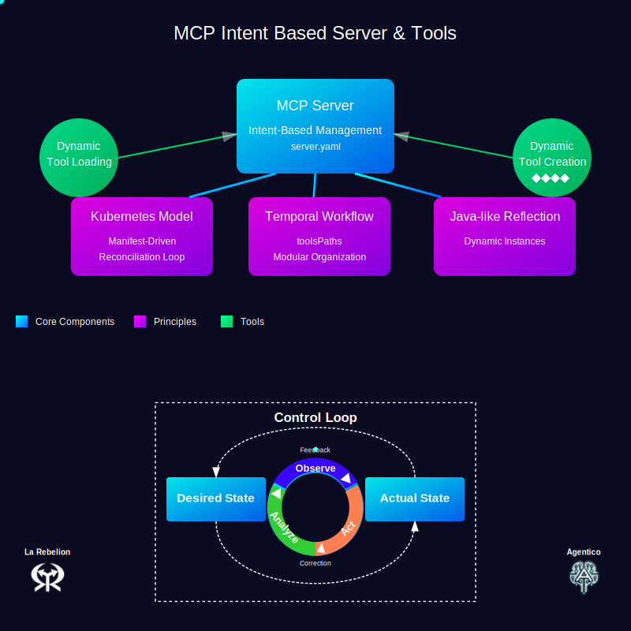

# Getting Started with MCP Intent Based

This is an early version of the MCP Intent-Based demo project. This project aims to demonstrate how to create and manage a flexible, dynamic server environment using a declarative manifest approach. Please note that this is a work in progress and may not be fully functional or stable. We welcome [feedback](https://go.rebelion.la/contact-us) to improve the project.

For more details check the `mcp-intent-based-demo` [README here](./mcp-intent-based-demo/README.md).



## Understanding the Intent-Based Manifest File

The `server.yaml` file is the heart of the MCP Intent Based approach. It defines:

```yaml
apiVersion: agentico.dev/v1
kind: Server
metadata:
  name: demo-mcp
  description: Demo MCP Server instance
  transport: stdio
  capabilities:
    - logging
    - tools
spec:
  template:
    metadata:
      scope: local
    spec:
      tools:
        - name: echo
          description: 'Utility tool that returns the exact input provided to it...'
        - name: reverse
          description: 'Text manipulation tool that reverses the order of characters...'
        - name: uppercase
          description: 'String transformation utility that converts all alphabetic characters...'
```

## Understanding the Server Initialization

The entry point of the application (`index.ts`) is **remarkably simple**:

```typescript
#!/usr/bin/env node

import createServerFromFile from "@agentico/mcp-intent-based";

async function startServer() {
  // either instance of Server or McpServer
  const server = await createServerFromFile();
  // Yes, that's all you need to do to start the server with Agentico and Intent Base AI!!
}

startServer().catch((error) => {
  console.error("Error starting server:", error);
  process.exit(1);
});
```

## Running the Demo

To start the server:

**NOTE: Make sure you add the `tools` path to the `TOOLS_PATH` environment variable, so that the server can find the tools.**

```bash
npm run build
TOOLS_PATH=$PWD/build/tools npm run inspector
# or
yarn build
yarn inspector
```

## Next Steps

- Explore the MCP Intent Based Server documentation for more advanced features
- Try creating your custom tools and incorporate them into the manifest
- Experiment with different transport types

For more information, visit the [MCP Intent Based Server and Tools documentation](https://agentico.dev/docs/mcp-intent-based).

## License
This project is licensed under the MIT License. See the [LICENSE](LICENSE) file for details.

## Get the latest information

To stay informed about the latest work regarding updates on Agentico, subscribe to our [newsletter](https://https://go.rebelion.la/agentico-news) for regular updates and announcements.

[La Rebelion Merch](https://go.rebelion.la/merch).

### Our different blogs:

- [La Rebelion](https://rebelion.la) - Topics around Cloud Native, Kubernetes, and DevOps.
- [Agentico](https://agentico.dev) - Topics around Agentic workflows, MCP, and AI.
- [K1s](https://k1s.sh) - Tools to help you with Kubernetes and Cloud Native.
- [Intent Based AI](https://intent-based.ai) - The specs and the tools to help you with Intent Based AI.
- [MCP](https://mcp.com.ai) - Our hub for the Model Context Protocol (MCP) and the tools we are building around it.
- [APICove](https://apicove.com) - Topics and tools around API and API Management.